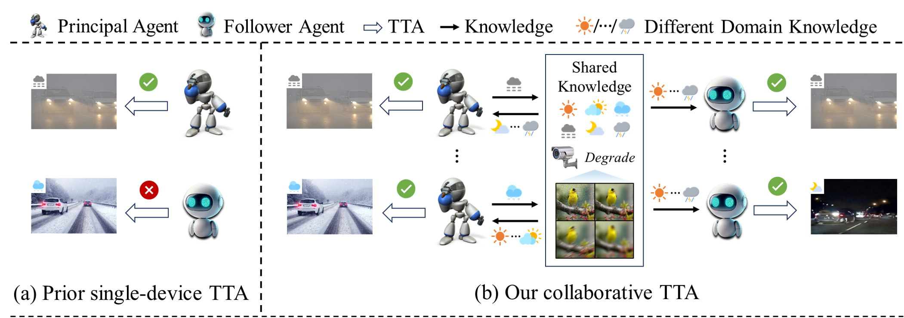
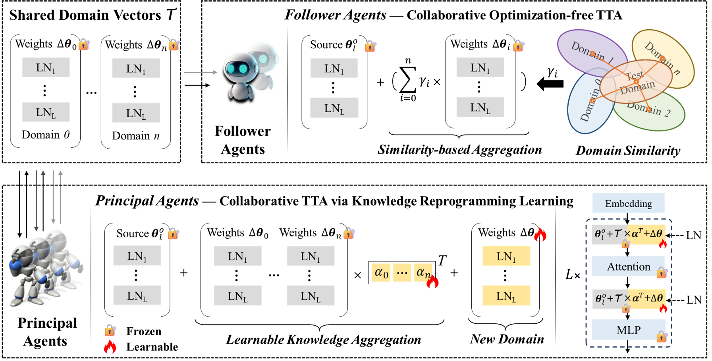

# 🤖⚡ Cross-Device Collaborative Test-Time Adaptation

<p align="center">

</p>

This is the official project repository for [Cross-Device Collaborative Test-Time Adaptation (NeurIPS 2024)](https://openreview.net/pdf?id=YyMiO0DWmI) by Guohao Chen, Shuaicheng Niu, Deyu Chen, Shuhai Zhang, Changsheng Li, Yuanqing Li and Mingkui Tan

* 1️⃣ CoLA conducts TTA in a multi-device collaborative manner. It enables knowledge accumulation, sharing, and exploitation across devices and heterogeneous scenearios to boost adaptation efficiency and performance, while keeping privacy preserved and communication efficient.


* 2️⃣ CoLA devise two collaboration strategies (_BP-Based_ & _Forward-Only_) to address a practical scenario where multiple devices with different computational resources and latency requirements need to perform TTA simultaneously. Our CoLA paradigm is decentralized and flexible, which allows all agents to join or leave the collaboration at any time.

<p align="center">

</p>


**Dependencies Installation:**
```
pip install cma
pip install torch==2.1.0 torchvision==0.16.0 torchaudio==2.1.0 --index-url https://download.pytorch.org/whl/cu118
pip install timm==0.9.10
```

**Data Preparation:**

This repository contains code for evaluation on ImageNet-C/R/Sketch with Vit-Base. But feel free to use your own data and models! Please check [here 🔗](dataset/README.md) for a detailed guide on preparing these datasets.

# Example: ImageNet-C Experiments

For lifelong test-time adaptation experiments, simply run the following commands
```
python3 main_lifelong.py \
    --data path/to/imagenet \
    --data_v2 path/to/imagenet-v2 \
    --data_sketch path/to/imagenet-sketch \
    --data_corruption path/to/imagenet-c \
    --data_rendition path/to/imagenet-r \
    --resume weights/original.pth \
    --algorithm [tent/cotta/eata/t3a/lame/eta(-cola)/sar(-cola)/deyo(-cola)]
```
included in ``main_lifelong.sh``. Please refer to ``main_bp_collboration.sh, main_fp_agents.sh, main_single_domain.sh`` for collobrative and single-domain TTA experiments, respectively.

# Correspondence

Please contact Guohao Chen by [chenguohao987 at gmail.com] and Shuaicheng Niu by [shuaicheng.niu at ntu.edu.sg] if you have any questions. 📬


# Citation

If our CoLA method for lifelong, collaborative, and single-domain TTA enhancement or our cross-deivce collaborative TTA setting is helpful in your research, please consider citing our paper:

```
@inproceedings{chen2024cross,
  title={Cross-Device Collaborative Test-Time Adaptation},
  author={Chen, Guohao and Niu, Shuaicheng and Chen, Deyu and Zhang, Shuhai and Li, Changsheng and Li, Yuanqing and Tan, Mingkui},
  booktitle={The Thirty-eighth Annual Conference on Neural Information Processing Systems},
  year={2024}
}
```

The source code will be soon available....